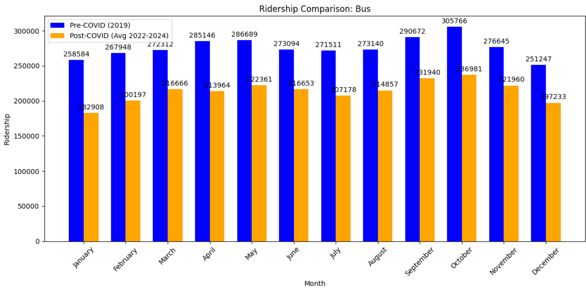
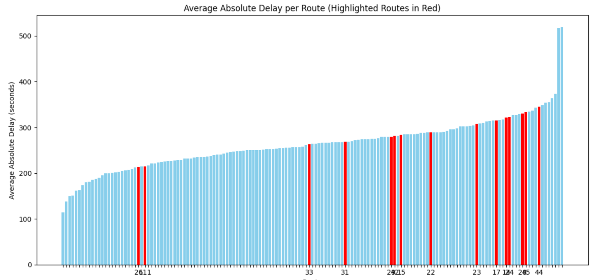

# Boston Bus Equity

Spark Project - Public transport plays an important role in the quality of life for residents in Massachusetts and Boston in terms of economic development, the environment, and equity. The goal of this project is to better understand the impact of bus performance on Boston residents by using MBTA bus data to examine service performance trends by geography. More information on this specific project from Spark can be found [here](https://docs.google.com/document/d/1BDWIXxLIoyoAc7ZoDu54bQZFiHViBrydTfgQigjtaNY/edit?tab=t.0).

### Midterm Check-in Video Link:

[Youtube Presentation Link](https://youtu.be/62y40h25OEA)

### Datasets:

We have used the following datasets from the MBTA site:

- [Ridership data from 2018-2024](https://mbta-massdot.opendata.arcgis.com/datasets/8daf4a33925a4df59183f860826d29ee/about)
- [Bus Stop Location and IDs](https://mbta-massdot.opendata.arcgis.com/datasets/24a97982b39f4febb504c9e6cb55879b_0/explore)
- [Arrival and Departure Times 2019-2024](https://mbta-massdot.opendata.arcgis.com/search?collection=dataset&q=mbta%20bus%20arrival%20departure%20time)
- [2023 Passenger Wide Survey Data](https://mbta-massdot.opendata.arcgis.com/datasets/MassDOT::mbta-2023-system-wide-passenger-survey-data/about)

### Ridership Data Processing and Modeling:

Pre and post covid ridership was calculated using available monthly ridership data for the entire MBTA bus system and for available bus routes. Pre-covid data was considered as all data from 2019, and post-covid data as averages from 2022 and 2023, and 2024. Data from 2020 and 2021 was considered to be during covid and was not used.

*Comparison of Ridership for all MBTA Routes*

### End to End Data Processing and Modeling:

The data, grouped by routes, will have an additional aggregate feature that contains the time in seconds between the arrival at the first stop and the arrival at the final stop. The intention of this feature is to reflect possible route efficiency changes over time, such as comparing pre and post-pandemic route duration times, along with the relative efficiency within areas of varying socioeconomic demographics. The motivation behind using route duration lies in its ability to contextualize route efficiency; it can be combined with other features like the number of stops to track per-stop efficiency, along with the accessibility and convenience of reaching certain areas of the city from areas of demographical interest.

### Delay Data Processing and Modeling:

Delays for individual bus trips was calculated by subtracting the actual arrival time from the scheduled arrival time in the arrival and departure dataset. This was then grouped by route and stop to find average and maximum delay times for all routes and stops. We associated these results with available geospatial data for bus stop and route locations to cluster stops and visually analyze locational disparities in ArcGIS.

### Visualizations and Preliminary Results:

*All Boston Bus Stops*

*10% of Bus Stops with Highest Recorded Absolute Average Delay*

*Average Absolute Route Delay, Stops Identified By the Livable Streets Report Are Highlighted*

Initial results show higher than average levels of delays among the bus routes first identified as underserved by the livable street reports in 2019 [here](https://d3n8a8pro7vhmx.cloudfront.net/livablestreetsalliance/pages/6582/attachments/original/1569205099/lsa-better-buses-2019-v9-20sep19.pdf?1569205099). We hope to further analyze this trend to understand how these disparities have changed over time, especially in the context of lower bus usage post-covid. We plan to analyze locational clusters of stops or routes that may be underserved to identify if there are any correlations between these disparities and groups impacted. 
